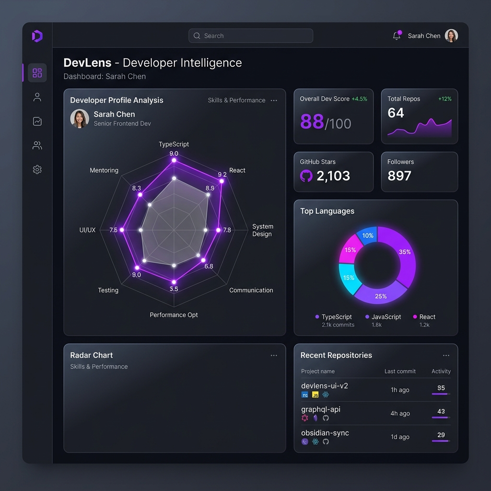

# ⬡ DevLens — Developer Intelligence Platform

DevLens is a premium, full-stack developer analytics and intelligence platform that processes GitHub profile footprints, aggregates code repository metrics, and calculates comprehensive engineering profiles using advanced metrics and custom intelligence scoring.

Built with a high-end, responsive dark theme design, glassmorphic interfaces, interactive visual telemetry, and robust data persistence in MySQL.

---

## 📸 Platform Preview



---

## ⚡ Tech Stack & Architecture

DevLens is engineered as a decoupled, multi-tier system built on industry-standard technologies:

| Tier | Component | Technology | Rationale |
|---|---|---|---|
| **Core Client** | Frontend App | **React 18 (Vite)** | Blazing fast build & load performance, highly reactive UI updates. |
| **Interactive UI** | Visual Telemetry | **Framer Motion + Recharts** | High-fidelity micro-interactions and vector charts (Radar/Donut/Bar). |
| **Styling** | Design System | **Vanilla CSS Variables** | Curated dark mode theme with zero runtime overhead or dependencies. |
| **API Server** | Backend Service | **Node.js + Express** | High concurrency handling, lightweight routing, fast JSON responses. |
| **Database** | Persistence Layer | **MySQL (Railway)** | Strict relational mapping for developer-to-repository parent-child bounds. |
| **Integration** | Upstream API | **GitHub REST API v3** | Real-time upstream data retrieval via authenticated HTTP. |

---

## 🚀 Key Features

* **🔍 Live Upstream Discovery**: Retrieve detailed developer profiles and repository stats directly from the GitHub API in real time.
* **📈 Cognitive Skill Mapping**: Interactive radar charts illustrating proficiency vectors (frontend, backend, systems, DevOps, mobile, cloud) computed from repo distributions.
* **⚡ Developer Intelligence Score**: Custom scoring algorithm assessing influence, productivity, scale, and contribution footprint.
* **📂 CRM-Style Profile Registry**: Searchable, paginated repository of analyzed profiles, facilitating side-by-side comparisons.
* **⚖️ Comparative Engineering**: Head-to-head profile comparison mode displaying overlay radar charts and side-by-side metric telemetry.
* **🔄 Adaptive Cache & Refresh**: Prevent duplicate storage, track profile analysis staleness, and trigger deep-sync refreshes.
* **🛡️ Security Hardened**: Includes rate-limiting, secure CORS policies, and Helmet-secured HTTP headers.

---

## 📐 Developer Intelligence Scoring

DevLens aggregates public footprint metadata using a multi-factor weighting formula to compute a developer's influence and presence score:

$$\text{Intelligence Score} = (\text{followers} \times 2.0) + (\text{total\_stars} \times 1.5) + (\text{total\_forks} \times 1.0) + (\text{public\_repos} \times 0.5)$$

---

## 🗄️ Relational Database Schema

The database utilizes strict referential constraints to enforce integrity between developers and their public code assets:

```sql
-- 👤 Developers Profile Master
CREATE TABLE profiles (
  id                   INT AUTO_INCREMENT PRIMARY KEY,
  username             VARCHAR(100)   NOT NULL UNIQUE,
  name                 VARCHAR(255),
  bio                  TEXT,
  avatar_url           VARCHAR(500),
  profile_url          VARCHAR(500),
  company              VARCHAR(255),
  location             VARCHAR(255),
  email                VARCHAR(255),
  blog                 VARCHAR(500),
  followers            INT            DEFAULT 0,
  following            INT            DEFAULT 0,
  public_repos         INT            DEFAULT 0,
  public_gists         INT            DEFAULT 0,
  total_stars          INT            DEFAULT 0,
  total_forks          INT            DEFAULT 0,
  most_used_language   VARCHAR(100),
  popularity_score     DECIMAL(10,2)  DEFAULT 0.00,
  account_age_days     INT            DEFAULT 0,
  github_created_at    DATETIME,
  analyzed_at          TIMESTAMP      DEFAULT CURRENT_TIMESTAMP ON UPDATE CURRENT_TIMESTAMP,
  created_at           TIMESTAMP      DEFAULT CURRENT_TIMESTAMP
);

-- 📦 Developer Code Repositories
CREATE TABLE repositories (
  id           INT AUTO_INCREMENT PRIMARY KEY,
  profile_id   INT          NOT NULL,
  repo_name    VARCHAR(255) NOT NULL,
  description  TEXT,
  language     VARCHAR(100),
  stars        INT          DEFAULT 0,
  forks        INT          DEFAULT 0,
  watchers     INT          DEFAULT 0,
  is_fork      BOOLEAN      DEFAULT FALSE,
  repo_url     VARCHAR(500),
  created_at   TIMESTAMP    DEFAULT CURRENT_TIMESTAMP,
  FOREIGN KEY (profile_id) REFERENCES profiles(id) ON DELETE CASCADE
);
```

---

## 📡 API Directory

All endpoints return uniform JSON envelopes: `{ success: true, data: ... }` or `{ success: false, error: "..." }`.

| Method | Endpoint | Payload / Query | Description |
|---|---|---|---|
| `GET` | `/api/health` | None | Service heartbeat and database connection check. |
| `POST` | `/api/profiles/analyze` | `{ "username": "string" }` | Fetch, analyze, save, and return a profile. |
| `POST` | `/api/profiles/refresh` | `{ "username": "string" }` | Re-fetch upstream data, update database, return profile. |
| `GET` | `/api/profiles` | `?page=1&limit=10` | Paginated catalog of all analyzed developers. |
| `GET` | `/api/profiles/:username` | None | Retrieve deep-profile data and top 10 repositories. |
| `DELETE` | `/api/profiles/:username`| None | Purge profile record and repositories from database. |

---

## 🛠️ Installation & Setup

### Prerequisites
* **Node.js** >= 18.0.0
* **MySQL** Server (Local or Cloud Instance)
* **GitHub Personal Access Token** (for high-volume API requests)

### 1. Initialize Server Environment

```bash
# Navigate to backend
cd backend

# Install dependencies
npm install
```

Configure local environment (`backend/.env`):
```env
PORT=5000
NODE_ENV=development
DB_HOST=localhost
DB_PORT=3306
DB_USER=root
DB_PASSWORD=your_secure_password
DB_NAME=github_analyzer
GITHUB_TOKEN=your_github_personal_access_token
CLIENT_URL=http://localhost:5173
```

Setup database schema:
```bash
npm run db:init
```

Launch Express API service:
```bash
npm run dev
```

### 2. Initialize Client Environment

```bash
# Navigate to frontend
cd ../frontend

# Install dependencies
npm install
```

Configure frontend variables (`frontend/.env`):
```env
VITE_API_URL=http://localhost:5000/api
```

Start Vite dev server:
```bash
npm run dev
```

Open [http://localhost:5173](http://localhost:5173) in your browser.

---

## 🧬 Project Architecture

```
github-profile-analyzer/
├── backend/
│   ├── src/
│   │   ├── config/       # Connections, environments, seed files
│   │   ├── controllers/  # API request router endpoints
│   │   ├── services/     # GitHub Client integration & Analyzer service
│   │   ├── repositories/ # Optimized SQL database queries (Repository pattern)
│   │   ├── routes/       # Express path declarations
│   │   ├── middleware/   # Request validators, global error handling
│   │   └── utils/        # Intelligence scoring algorithms
│   └── server.js         # API Gateway Entrypoint
└── frontend/
    └── src/
        ├── api/          # Central API Client interfaces
        ├── components/   # Modular visualization widgets & UI modules
        ├── landing/      # Full-scale interactive product marketing site
        └── pages/        # Route-level workspace layouts
```
